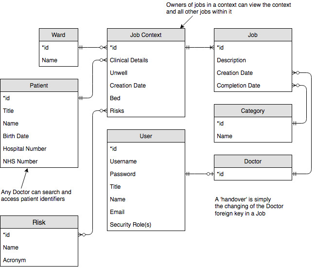
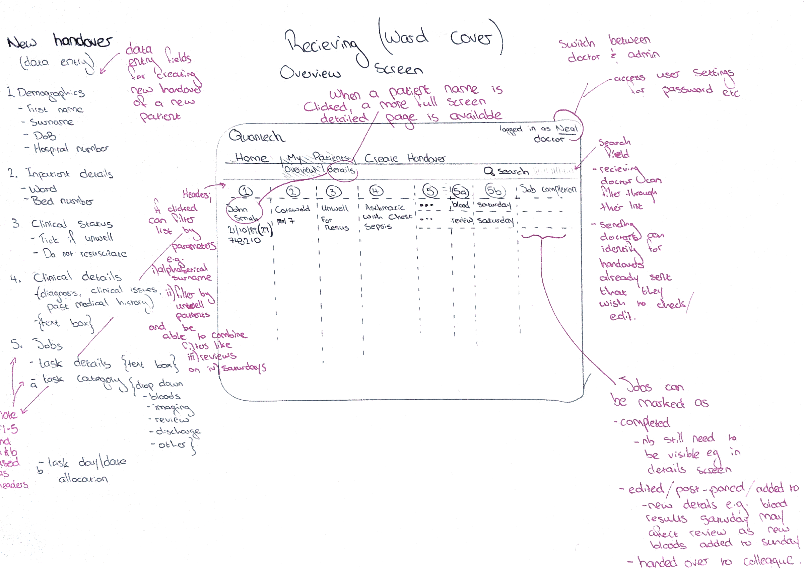

# Electronic Handover

*University of Bristol Software Product Engineering Project*

Team Quantech: Tom Walker, Nuha Tumia, Louis Heath, Tilly Woodfield, Rob Houston, Will Hawkins

### Version 3

This version marks our change in approach from a patient transfer system of sorts
to a system which manages the display and transfer of patient specific jobs.

The ER diagram below shows the new database structure.

And the illustration below is our goal for the general UI.

